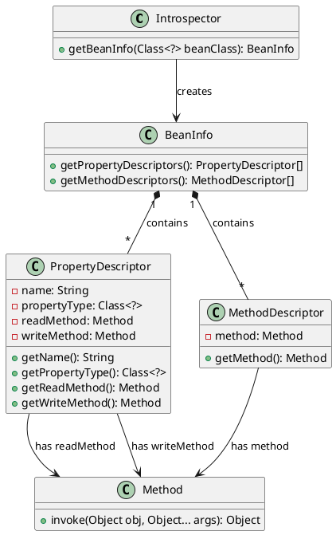

Reflection or runtime introspection is a powerful feature in Java. some cool features we use in Spring like copyProperties, core concepts are come from Jdk only.


Under JDK **java.beans** package, there are some key classes used for reflection.

- Introspector
- BeanInfo
- PropertyDescriptor 
- MethodDescriptor


<!--more-->





- **Introspector**: It conducts introspective analysis of a JavaBean class through the getBeanInfo method and generates a BeanInfo object.
- **BeanInfo**: It contains an array of property descriptors and an array of method descriptors of a JavaBean.
- **PropertyDescriptor**: It represents a property of a JavaBean and includes the property name, property type, the reading method (getter), and the writing method (setter).
- **MethodDescriptor**: It represents a method in a JavaBean and contains a Method object.
- **Method**: It is a class in the Java reflection mechanism. Both the PropertyDescriptor and MethodDescriptor reference it, which is used to call methods at runtime.

```java

class Person {
    private String name;
    private int age;

    public String getName() {
        return name;
    }

    public void setName(String name) {
        this.name = name;
    }

    public int getAge() {
        return age;
    }

    public void setAge(int age) {
        this.age = age;
    }
}

public class PropertyDescriptorExample {
    public static void main(String[] args) throws Exception {

        BeanInfo beanInfo = Introspector.getBeanInfo(Person.class);

        PropertyDescriptor[] propertyDescriptors = beanInfo.getPropertyDescriptors();

        for (PropertyDescriptor propertyDescriptor : propertyDescriptors) {
            String propertyName = propertyDescriptor.getName();
            Class<?> propertyType = propertyDescriptor.getPropertyType();
            Method readMethod = propertyDescriptor.getReadMethod();
            Method writeMethod = propertyDescriptor.getWriteMethod();

            System.out.println("Property Name: " + propertyName);
            System.out.println("Property Type: " + propertyType);
            System.out.println("Read Method: " + readMethod);
            System.out.println("Write Method: " + writeMethod);
            System.out.println("----------------------");
        }

        Person person = new Person();

        PropertyDescriptor nameDescriptor = new PropertyDescriptor("name", Person.class);

        Method setNameMethod = nameDescriptor.getWriteMethod();

        setNameMethod.invoke(person, "John");

        Method getNameMethod = nameDescriptor.getReadMethod();

        String name = (String) getNameMethod.invoke(person);
        System.out.println("Person's name: " + name);
    }
}
```

